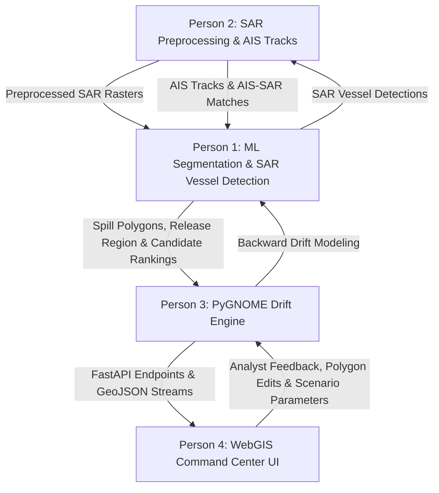

# MarineShield Four-Person Workstream Mapping

> **CRITICAL ARCHITECTURAL DIRECTIVE**: Do NOT implement any of these workstreams in this task. This document establishes authoritative ownership, subsystem boundaries, input/output schemas, and inter-workstream dependencies for the team.

---

## 1. Overview of Team Architecture

The operational scope of MarineShield spans the complete incident lifecycle across 6 core functional modules (Members 1 to 6). The 6 functional modules are mapped into a **Four-Person Engineering Workstream Structure**:

```
 ┌─────────────────────────────────────────────────────────────────────────────────┐
 │                                   PERSON 1                                      │
 │   [Member 2: ML, Oil Segmentation, Look-Alike & SAR Vessel Detection]           │
 │   + [Member 4: Release Estimation, Evidence Engine & Attribution]               │
 └────────────────                        ┬                                ────────┘
                                          │
                                          ▼
 ┌─────────────────────────────────────────────────────────────────────────────────┐
 │                                   PERSON 2                                      │
 │   [Member 1: Satellite Acquisition & Sentinel-1 SAR Preprocessing]              │
 │   + [Member 3: AIS Tracking, PostGIS, AIS–SAR Matching & Anomaly Intelligence] │
 └────────────────                        ┬                                ────────┘
                                          │
                                          ▼
 ┌─────────────────────────────────────────────────────────────────────────────────┐
 │                                   PERSON 3                                      │
 │   [Member 5: PyGNOME Drift, Threat Analysis & Replay Engine]                    │
 │   + [Member 6 Backend: FastAPI Services, Priority Engine & Reports]            │
 └────────────────                        ┬                                ────────┘
                                          │
                                          ▼
 ┌─────────────────────────────────────────────────────────────────────────────────┐
 │                                   PERSON 4                                      │
 │   [Member 6 Frontend: React / WebGIS Command Center, Review & Field Mode UI]   │
 └─────────────────────────────────────────────────────────────────────────────────┘
```

---

## 2. Detailed Workstream Ownership & Responsibilities

### **Person 1 — Machine Learning, Detection, Release Estimation & Attribution Engine**
- **Consolidated Ownership**: Functional **Member 2** + Functional **Member 4**
- **Scope & Subsystems**:
  1. **Oil-Spill Segmentation (Module B / Feature 6)**:
     - Primary U-Net architecture and single SegFormer benchmark candidate.
     - Pixel-wise oil probability masks, binary oil masks, geospatial spill polygons, centroid computation, estimated slick area ($\text{km}^2$), and geometry analytics (perimeter, orientation, elongation, fragmentation).
     - Multi-slick detection and fragment tracking (Feature 7).
  2. **Look-Alike Rejection Classifier (Module C / Feature 10-12)**:
     - Verification classifier distinguishing petroleum oil from biogenic slicks, low-wind calm areas, natural films, and ship wakes.
     - Hard-negative learning pipeline (Feature 11) and uncertain classification handling (Feature 12).
  3. **Spill Severity & Thickness Classifier (Module D / Feature 9)**:
     - Coarse operational severity classification (`SHEEN`, `MODERATE`, `THICK / HIGH-SEVERITY`) using SAR intensity and contextual indicators.
  4. **SAR Vessel Detection (Module E / Feature 15)**:
     - Direct ship detection in SAR imagery outputting observed vessel positions, bounding geometries, radar backscatter features, and detection confidence.
     - *Note*: Member 2 owns SAR vessel detection; Member 3 (Person 2) consumes these detections for AIS-SAR reconciliation.
  5. **Release Time & Location Estimation (Layer 5 / Features 20-23)**:
     - Integrates backward drift inputs (from Person 3 / Member 5) to compute probable release region polygon ($\text{km}^2$ uncertainty area) and estimated release time window $[t_{start}, t_{end}]$.
     - Supports single, multiple, and continuous discharge release hypotheses.
  6. **Candidate Hypothesis Generation (Section 6 / Feature 24)**:
     - Formulates hypothesis set: $H_1 \dots H_n$ (Specific vessels), $H_{untracked}$ (SAR-detected dark vessel), $H_{non-vessel}$ (Offshore/natural source), $H_{unknown}$ (Unknown origin).
  7. **Evidence + Contradiction Engine (Module F / Features 25-29)**:
     - Evaluates candidates using evidence scoring:
       $$E(H) = w_s S_{spatial} + w_t S_{temporal} + w_r S_{trajectory} + w_d S_{drift} + w_v S_{vessel} + w_b S_{behavior} - w_c C_{contradiction}$$
     - Generates supporting-evidence bullet panels, contradictory-evidence panels, data limitation indicators, and evidence provenance metadata.
  8. **Counterfactual Attribution & Unknown Engine (Section 6 / Features 30-32)**:
     - Counterfactual removal analysis (testing hypothesis score deltas when top vessel is removed).
     - Explicit `UNKNOWN` source status engine when evidence thresholds are not met.
     - Attribution confidence calibration (strong, moderate, weak, insufficient).
- **Inputs**: Preprocessed SAR normalized arrays (from Person 2 / Member 1), AIS vessel trajectories & AIS-SAR match flags (from Person 2 / Member 3), backward drift vectors (from Person 3 / Member 5).
- **Outputs**: Verified spill polygons, confidence masks, severity classes, SAR vessel detections, estimated release region polygon & time window, candidate hypothesis rankings, supporting/contradictory evidence panels, counterfactual scores, and provenance metadata.

---

### **Person 2 — Satellite Remote Sensing & Maritime Vessel Intelligence**
- **Consolidated Ownership**: Functional **Member 1** + Functional **Member 3**
- **Scope & Subsystems**:
  1. **Sentinel-1 SAR Acquisition & Preprocessing (Module A / Features 1, 4)**:
     - Satellite imagery ingestion pipeline (Sentinel-1 IW GRD).
     - Preprocessing chain: Orbit correction $\to$ thermal noise removal $\to$ radiometric calibration ($\sigma^0$ dB) $\to$ speckle filtering $\to$ geometric terrain correction $\to$ dynamic tiling & normalization $\to$ scene metadata extraction.
  2. **AIS Vessel Track Ingestion & PostGIS Processing (Module 13-14 / Features 1, 13-14)**:
     - Ingestion and spatial indexing of AIS vessel tracks (MMSI, coordinates, speed over ground, course, heading, timestamp, vessel dimensions).
     - Spatial-temporal trajectory search within specified release windows and geographic bounding boxes.
  3. **AIS–SAR Reconciliation Engine (Module F / Feature 16)**:
     - Deterministic spatio-temporal matching algorithm comparing SAR vessel detections (from Person 1 / Member 2) with AIS tracks based on distance, time offset, heading delta, speed delta, and vessel dimensions.
     - Outputs match status: `Matched Vessel`, `Uncertain Match`, `Unmatched SAR Detection`.
  4. **Dark Vessel Flagging & AIS Anomaly Intelligence (Module G / Features 17-19)**:
     - Flagging SAR-observed vessels lacking AIS correlation (`Unmatched Vessel`).
     - Detecting AIS anomalies around estimated release windows: transmission gaps, unusual loitering, route deviations, sudden speed changes, and abnormal turns.
     - Generating vessel behavior timelines.
  5. **Pluggable Data Strategy (Section 18 / Feature 1)**:
     - Abstraction layer supporting Global Fishing Watch APIs, Copernicus CDS, INCOIS oceanographic products, and DG Shipping AIS feeds.
- **Inputs**: Sentinel-1 raw SAFE granules / Copernicus CDS API, public/private AIS data streams, SAR vessel detections (from Person 1 / Member 2).
- **Outputs**: Preprocessed ML-ready SAR rasters (GeoTIFF/Numpy arrays), clean AIS trajectory GeoJSONs, PostGIS spatial queries, AIS-SAR match records, dark vessel flags, and AIS anomaly timelines.

---

### **Person 3 — Trajectory Forecasting, Threat Assessment & Backend Intelligence Services**
- **Consolidated Ownership**: Functional **Member 5** + Backend Half of Functional **Member 6**
- **Scope & Subsystems**:
  1. **PyGNOME Forward & Backward Drift Modeling (Module G / Features 20, 33-36)**:
     - Integration of NOAA PyGNOME particle tracking engine.
     - Backward drift simulation (feeding release region estimation in Person 1 / Member 4).
     - Forward trajectory forecasting ($+6\text{h}, +12\text{h}, +24\text{h}, +48\text{h}$) outputting central trajectory path and ensemble probability uncertainty cones.
     - Time-lapse spill evolution animation data generation.
  2. **Environmental Threat & GIS Impact Analysis (Module H / Features 38-42)**:
     - Spatial intersection of projected spill geometry with GIS layers (mangroves, MPAs, coastlines, fishing zones, ports).
     - Computes estimated time to impact (ETA hours), impact probability, affected area ($\text{km}^2$), and environmental sensitivity scores.
  3. **What-If Scenario Simulator (Module 12 / Feature 37)**:
     - Simulation engine allowing operators to modify environmental forcing parameters (wind speed/direction, current speed/direction) and assess trajectory sensitivity.
  4. **Historical Incident Time Machine Engine (Module 14 / Features 48-54)**:
     - Replay framework executing the pipeline under strict temporal slicing ($t \le t_{obs}$) to prevent hindsight bias.
     - Pipeline metric evaluations (segmentation IoU/F1, vessel detection mAP, attribution Top-1/Top-3/MRR, drift spatial error).
  5. **MarineShield Response Priority Engine (Module I / Features 43-44)**:
     - Operational decision metric:
       $$\text{Priority} = \text{Severity} \times \text{Sensitivity} \times \text{Impact Probability} \times \text{Time Urgency} \times \text{Evidence Quality}$$
     - Ordinal alert level output: `LOW`, `MEDIUM`, `HIGH`, `CRITICAL`.
  6. **Response & Alert Recommendation Engine (Module 10 / Features 45-47)**:
     - Rule-based action recommendations, stakeholder alert triggers, incident state workflow manager (`Detected` $\to$ `Under Verification` $\to$ `Confirmed` $\to$ `Under Investigation` $\to$ `Response Active` $\to$ `Resolved`), and next-best-observation zone calculator (Feature 46).
  7. **FastAPI Services, MLOps & Incident Reports (Module 16 / Features 72-76, 87-99)**:
     - Async REST API endpoints (`/api/v1/...`), background task queue (Celery/Redis), model/dataset version tracking, audit logging, and one-click PDF/JSON Incident Report Generator.
- **Inputs**: Spill polygons & severity (from Person 1 / Member 2), candidate vessel rankings (from Person 1 / Member 4), raw GIS environmental shapefiles, ocean current/wind forcing rasters (HYCOM / GFS / ERA5 / INCOIS).
- **Outputs**: PyGNOME drift GeoJSONs with uncertainty cones, threat intersection tables, MarineShield Response Priority scores, alert payloads, what-if comparison deltas, replay benchmark results, FastAPI endpoints, and PDF/JSON incident reports.

---

### **Person 4 — WebGIS Command Center Frontend & User Experience**
- **Consolidated Ownership**: Frontend/WebGIS Half of Functional **Member 6**
- **Scope & Subsystems**:
  1. **Unified Interactive WebGIS Command Center (Module L / Features 61-66)**:
     - Interactive map interface (MapLibre GL / Leaflet) visualizing SAR imagery, spill polygons, confidence masks, AIS tracks, SAR vessels, unmatched vessels, release region bounds, forecast uncertainty cones, and environmental GIS layers.
  2. **Layer, Temporal & Split-View Controls (Features 62-64)**:
     - Multi-layer visibility toggles, temporal playback scrubber (historical transit $\to$ current slick $\to$ $+48\text{h}$ forecast), and split-view comparison (raw SAR vs segmentation mask, baseline vs scenario).
  3. **Explainability & Attribution Panel (Module M / Features 67-71)**:
     - Interactive evidence inspector rendering candidate vessel rankings, supporting vs contradictory bullet panels, data quality progress bars, counterfactual toggle, and explicit `UNKNOWN` source banners.
  4. **Response Command & Alert Dashboard (Features 44, 65, 78)**:
     - Visual priority gauge ($0-100$), alert notifications, recommended action checklist, incident lifecycle status manager, and next-best-observation zone highlight.
  5. **Human-in-the-Loop Analyst System (Module K / Features 55-60)**:
     - Analyst confirmation controls (`Confirmed Oil`, `False Alarm`, `Look-Alike`, `Uncertain`), manual polygon editing, analyst evidence notes, human approval step before escalation, and active-learning feedback collection.
  6. **Historical Incident Time Machine UI (Features 48, 63)**:
     - Replay interface allowing operators to select historical events, step through time, and visualize predictions against documented outcomes.
  7. **Low-Bandwidth Field Mode & Usability (Module 17 / Features 101-107)**:
     - Responsive mobile/tablet field mode layout, cached incident status, downloadable offline reports, color-blind safe status indicators (icons + text), and high-contrast dark/light mode themes.
- **Inputs**: FastAPI REST API endpoints & WebSocket streams (from Person 3 backend).
- **Outputs**: Production React / WebGIS command UI, analyst feedback payload submissions, field mode view, and client-side map rendering.

---

## 3. Inter-Workstream Dependency Diagram & Contracts



### Dependency Contracts:
1. **Person 2 $\to$ Person 1**: Person 2 delivers standardized 2D GeoTIFF/Numpy SAR arrays ($\sigma^0$ dB values) and clean AIS trajectory GeoJSONs.
2. **Person 1 $\to$ Person 2**: Person 1 delivers SAR vessel detection coordinates and bounding features for Person 2's AIS-SAR reconciliation engine.
3. **Person 3 $\to$ Person 1**: Person 3 provides backward drift trajectory rasters/vectors to Person 1's Release Reconstruction component.
4. **Person 1 $\to$ Person 3**: Person 1 delivers GeoJSON spill polygons, estimated release region polygons, release time windows $[t_1, t_2]$, and hypothesis evidence score structures to Person 3's forecasting, threat, priority, and report engines.
5. **Person 3 $\to$ Person 4**: Person 3 exposes versioned REST endpoints (`/api/v1/...`) returning validated JSON/GeoJSON payloads.
6. **Person 4 $\to$ Person 3**: Person 4 passes user interactions (analyst verification tags, manual geometry edits, what-if parameters, date filters) to Person 3 backend APIs.

---

## 4. Implementation Rule
> **NO WORKSTREAM IMPLEMENTATION IS PERMITTED IN THIS TASK.**
> This file establishes the mandatory operational division for all future development.
